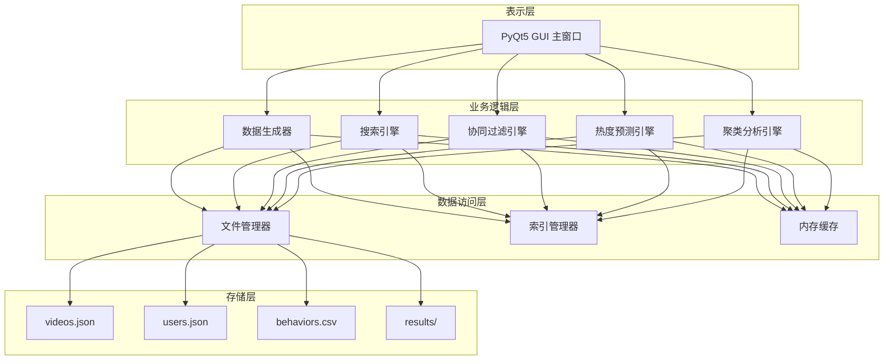
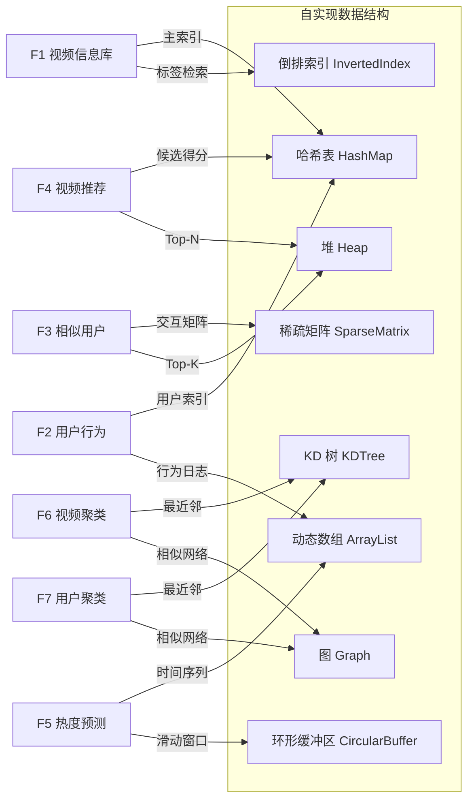

# 短视频推荐系统 — 技术架构文档

> **核心主线**：本文档以**数据结构**为主线，阐述每个功能模块选用的核心数据结构、算法及其时空复杂度。

---

## 1. 系统整体架构



### 分层说明

| 层次 | 职责 | 核心数据结构 |
|------|------|-------------|
| **表示层** | GUI 交互、参数输入、结果展示 | Qt Model/View（表格模型） |
| **业务逻辑层** | 算法计算 | 哈希表、堆、稀疏矩阵、图 |
| **数据访问层** | 文件读写、索引、缓存 | B+树索引、倒排索引、LRU 缓存 |
| **存储层** | 持久化文件 | JSON / CSV 文件 |

---

## 2. 核心数据结构总览

下表汇总了整个项目中使用到的所有核心数据结构及其应用场景：

| 数据结构 | 类型 | 应用场景 | 时间复杂度（关键操作） |
|---------|------|---------|---------------------|
| **哈希表 (HashMap)** | 线性 | 视频/用户的 O(1) 查找；倒排索引 | 查找 O(1)，插入 O(1) |
| **动态数组 (ArrayList)** | 线性 | 行为日志存储；排序结果 | 访问 O(1)，追加 O(1) |
| **最小/最大堆 (Heap)** | 非线性(树) | Top-K 相似用户；Top-N 推荐视频 | 插入 O(log K)，取极值 O(1) |
| **稀疏矩阵 (Sparse Matrix)** | 非线性 | 用户-视频交互矩阵（协同过滤） | 遍历非零元素 O(nnz) |
| **倒排索引 (Inverted Index)** | 线性+哈希 | 按标签/类目检索视频 | 查询 O(1) + O(结果数) |
| **图 (Graph)** | 非线性 | 用户相似度网络；视频关联网络 | 邻接表遍历 O(V+E) |
| **邻接表 (Adjacency List)** | 线性+链表 | 图的存储结构 | 查邻居 O(度数) |
| **时间序列数组** | 线性 | 热度预测的历史数据 | 滑动窗口 O(W) |
| **KD 树 (KD-Tree)** | 非线性(树) | 聚类中的最近邻搜索加速 | 查询 O(log N) 平均 |
| **优先队列 (Priority Queue)** | 非线性(堆) | 推荐得分排序 | 插入 O(log N) |
| **链表 (LinkedList)** | 线性 | 哈希冲突链、LRU 缓存 | 插入/删除 O(1) |

---

## 3. 各功能模块数据结构详解

### 3.1 F1: 视频信息库 — 哈希表 + 倒排索引

#### 核心数据结构

```
┌─────────────────────────────────────────────────────┐
│  视频主索引 (HashMap)                                │
│  key: video_id (int)                                │
│  value: Video 对象                                   │
│                                                     │
│  video_id → { title, category, tags[], duration,    │
│               publish_time, author_id }              │
└─────────────────────────────────────────────────────┘

┌─────────────────────────────────────────────────────┐
│  倒排索引 (Inverted Index)                           │
│                                                     │
│  category_index:                                    │
│    "搞笑幽默" → [vid_1, vid_5, vid_99, ...]         │
│    "美食烹饪" → [vid_2, vid_8, vid_102, ...]        │
│                                                     │
│  tag_index:                                         │
│    "家常菜"   → [vid_2, vid_45, vid_300, ...]       │
│    "王者荣耀" → [vid_10, vid_88, ...]               │
└─────────────────────────────────────────────────────┘
```

#### 设计说明

- **哈希表**：以 `video_id` 为键，实现 O(1) 的视频查找。处理 10 万量级数据时，哈希表的常数时间查找远优于线性扫描。
- **倒排索引**：本质是 `HashMap<String, List<int>>`，将标签/类目映射到视频 ID 列表。支持按标签快速检索视频，搜索复杂度 O(1) + O(结果数)。
- **哈希冲突处理**：采用链地址法（链表），负载因子 > 0.75 时自动扩容。

#### 复杂度分析

| 操作 | 时间复杂度 | 空间复杂度 |
|------|-----------|-----------|
| 按 ID 查找视频 | O(1) | O(N) |
| 按标签搜索 | O(1) + O(M)，M 为结果数 | O(N×T)，T 为平均标签数 |
| 插入新视频 | O(T)，需更新 T 个倒排索引 | — |

---

### 3.2 F2: 用户行为模拟 — 动态数组 + 哈希表

#### 核心数据结构

```
┌─────────────────────────────────────────────────────┐
│  用户主索引 (HashMap)                                │
│  key: user_id (int)                                 │
│  value: User 对象                                    │
│    { name, preference_tags[], register_time,        │
│      watch_history: [video_id, ...] }               │
└─────────────────────────────────────────────────────┘

┌─────────────────────────────────────────────────────┐
│  行为日志 (ArrayList / 动态数组)                     │
│                                                     │
│  [                                                  │
│    { user_id, video_id, action, timestamp, dur },   │
│    { user_id, video_id, action, timestamp, dur },   │
│    ...       // 可达百万级记录                       │
│  ]                                                  │
└─────────────────────────────────────────────────────┘

┌─────────────────────────────────────────────────────┐
│  用户行为索引 (HashMap)                              │
│  key: user_id                                       │
│  value: Set<video_id>  // 该用户观看过的视频集合      │
└─────────────────────────────────────────────────────┘
```

#### 设计说明

- **动态数组**：行为日志按时间顺序追加，天然适合数组的尾部插入 O(1) 特性。
- **用户行为索引**：`HashMap<int, HashSet<int>>`，快速判断用户是否看过某视频（O(1)），这是协同过滤的基础操作。
- **行为生成策略**：基于用户偏好标签的概率分布，使用加权随机采样生成观看行为。

---

### 3.3 F3: 相似用户分析 — 稀疏矩阵 + 最大堆

#### 核心数据结构

```
┌─────────────────────────────────────────────────────┐
│  用户-视频交互矩阵 (Sparse Matrix, CSR 格式)         │
│                                                     │
│        v1  v2  v3  v4  v5  ...  v100000             │
│  u1  [  1   0   1   0   1  ...    0   ]             │
│  u2  [  0   1   0   0   1  ...    1   ]             │
│  u3  [  1   1   0   1   0  ...    0   ]             │
│  ...                                                │
│  u10000                                             │
│                                                     │
│  CSR 存储:                                          │
│    values:     [1, 1, 1, 1, 1, 1, 1, 1, ...]       │
│    col_index:  [0, 2, 4, 1, 4, 99999, 0, 1, 3,...] │
│    row_ptr:    [0, 3, 6, 10, ...]                   │
└─────────────────────────────────────────────────────┘

┌─────────────────────────────────────────────────────┐
│  Top-K 相似用户堆 (Max-Heap / Min-Heap)              │
│                                                     │
│  维护大小为 K 的最小堆:                               │
│  当新的相似度得分 > 堆顶时，替换堆顶并下沉调整         │
│                                                     │
│       0.82                                          │
│      /    \                                         │
│   0.85    0.91                                      │
│   / \     / \                                       │
│ 0.88 0.90 0.93 0.95                                 │
└─────────────────────────────────────────────────────┘
```

#### 算法流程

1. 从稀疏矩阵中取出目标用户行向量
2. 与其他所有用户行向量计算**余弦相似度**：
   ```
   sim(u, v) = (u · v) / (||u|| × ||v||)
   ```
3. 使用大小为 K 的**最小堆**维护 Top-K 结果

#### 复杂度分析

| 操作 | 时间复杂度 | 说明 |
|------|-----------|------|
| 构建稀疏矩阵 | O(B)，B 为行为总数 | 遍历行为日志 |
| 计算一对用户相似度 | O(min(d_u, d_v)) | d 为用户观看视频数 |
| 找 Top-K 相似用户 | O(N × d̄ × log K) | N 用户，d̄ 平均观看数 |
| 空间（稀疏矩阵） | O(nnz)，非零元素数 | 远小于 N×M 的稠密矩阵 |

> **为什么用稀疏矩阵？** 10,000 用户 × 100,000 视频 = 10 亿元素。但每用户平均观看 50-200 个视频，非零率仅 0.05%-0.2%。CSR 格式仅存储非零元素，空间效率提升 500-2000 倍。

> **为什么用堆而不排序？** 对 N 个用户排序需 O(N log N)，而用堆只需 O(N log K)，当 K << N 时显著更快。

---

### 3.4 F4: 视频推荐 — 哈希表 + 优先队列

#### 算法流程（User-Based CF）

```
┌────────────┐     ┌──────────────────┐     ┌───────────────────┐
│ 目标用户 u  │     │ 相似用户集合       │     │ 候选视频评分        │
│            │────▶│ {u1: 0.95,       │────▶│ HashMap<vid, score>│
│            │     │  u2: 0.91,       │     │ vid_x: 2.73       │
│            │     │  u3: 0.88, ...}  │     │ vid_y: 2.51       │
└────────────┘     └──────────────────┘     │ vid_z: 1.99       │
                                            │ ...               │
                                            └────────┬──────────┘
                                                     │
                                              ┌──────▼──────┐
                                              │ 优先队列      │
                                              │ (Max-Heap)   │
                                              │ Top-N 推荐   │
                                              └─────────────┘
```

#### 核心数据结构

- **候选视频得分表**：`HashMap<video_id, float>`
  - 遍历每个相似用户的观看列表，排除目标用户已看过的视频
  - 对候选视频累加加权得分：`score[v] += sim(u, neighbor) × rating`
- **最大堆 (Max-Heap)**：从候选表中选出得分最高的 Top-N 视频

#### 复杂度分析

| 操作 | 时间复杂度 |
|------|-----------|
| 汇总候选视频得分 | O(K × d̄)，K 个相似用户，d̄ 平均观看数 |
| 取 Top-N 推荐 | O(C × log N)，C 为候选视频数 |

---

### 3.5 F5: 热度预测 — 时间序列数组 + 滑动窗口

#### 核心数据结构

```
┌─────────────────────────────────────────────────────┐
│  热度时间序列 (固定长度数组)                           │
│                                                     │
│  time_slots[]:  按天/小时统计观看次数                  │
│  [Day1: 120, Day2: 145, Day3: 98, Day4: 210, ...]   │
│                                                     │
│  使用 HashMap<video_id, int[]> 为每个视频维护时间序列   │
└─────────────────────────────────────────────────────┘

┌─────────────────────────────────────────────────────┐
│  滑动窗口 (环形缓冲区 / Circular Buffer)              │
│                                                     │
│  窗口大小 W = 7 (一周移动平均)                        │
│  ┌───┬───┬───┬───┬───┬───┬───┐                      │
│  │120│145│ 98│210│180│165│200│  ← 窗口内元素          │
│  └───┴───┴───┴───┴───┴───┴───┘                      │
│  sum = 1118,  avg = 159.7                           │
│  新值进入 → 减去最老值 + 加上新值 → O(1) 更新          │
└─────────────────────────────────────────────────────┘
```

#### 预测算法

1. **移动平均法**：窗口大小 W 的滑动平均平滑波动
2. **线性回归**：对时间序列做最小二乘拟合，外推未来趋势
3. **加权移动平均**：近期权重更高，适应趋势变化

#### 复杂度分析

| 操作 | 时间复杂度 |
|------|-----------|
| 构建时间序列 | O(B_v)，B_v 为该视频的行为数 |
| 滑动窗口移动平均 | O(T)，T 为时间槽数 |
| 线性回归拟合 | O(T) |

---

### 3.6 F6 & F7: 聚类分析 — KD 树 + 图

#### 核心数据结构

```
┌─────────────────────────────────────────────────────┐
│  特征向量矩阵 (二维数组)                              │
│                                                     │
│  F6 视频特征: 每行 = 一个视频, 每列 = 一个用户         │
│  F7 用户特征: 每行 = 一个用户, 每列 = 一个标签/类目     │
│                                                     │
│  降维后 (PCA/SVD): 降到 50-100 维以提高效率            │
└─────────────────────────────────────────────────────┘

┌─────────────────────────────────────────────────────┐
│  K-Means 聚类涉及的数据结构:                          │
│                                                     │
│  centroids[K]:     K 个聚类中心 (数组)                │
│  assignments[N]:   N 个数据点的簇分配 (数组)           │
│  clusters[K]:      K 个簇的成员列表 (数组的数组)       │
│                                                     │
│  每轮迭代:                                           │
│    1. 为每个点找最近中心 → KD 树加速为 O(N log K)     │
│    2. 更新中心 = 簇内均值 → O(N × D)                 │
└─────────────────────────────────────────────────────┘

┌─────────────────────────────────────────────────────┐
│  KD 树 (用于最近邻搜索)                               │
│                                                     │
│              (x=5.2)                                │
│             /       \                               │
│        (y=3.1)    (y=7.8)                           │
│        /   \       /   \                            │
│     (x=2) (x=4) (x=6) (x=9)                        │
│                                                     │
│  在 D 维空间中查找最近邻: O(log N) 平均               │
└─────────────────────────────────────────────────────┘

┌─────────────────────────────────────────────────────┐
│  相似度图 (Graph + 邻接表)                            │
│                                                     │
│  节点: 视频/用户                                     │
│  边: 相似度超过阈值的连接                              │
│  存储: 邻接表 HashMap<id, List<(neighbor_id, weight)>>│
│                                                     │
│  u1 ── 0.92 ── u3                                   │
│  |  \          |                                    │
│ 0.85  0.78   0.91                                   │
│  |      \      |                                    │
│  u2      u5 ── u4                                   │
│                                                     │
│  层次聚类: 通过图的连通分量识别自然分组                  │
└─────────────────────────────────────────────────────┘
```

#### 复杂度分析

| 操作 | K-Means | 层次聚类 |
|------|---------|---------|
| 时间 | O(I × N × K × D) | O(N² log N) |
| 空间 | O(N × D + K × D) | O(N²) |
| I = 迭代次数, N = 数据点, K = 聚类数, D = 维度 | | |

> **F7 用户聚类降维策略**：将用户的行为向量（100,000 维）通过 TF-IDF 或 SVD 降到 50 维，既减少计算量，又消除稀疏性问题。

---

## 4. 文件存储设计

### 4.1 文件格式

| 文件 | 格式 | 说明 | IO 策略 |
|------|------|------|---------|
| `data/videos.json` | JSON | 视频元数据，10 万条 | 启动时全量加载到哈希表 |
| `data/users.json` | JSON | 用户元数据，1 万条 | 启动时全量加载到哈希表 |
| `data/behaviors.csv` | CSV | 行为日志，百万级 | **按需流式读取**，不一次性全部加载 |
| `data/indexes/tag_index.json` | JSON | 倒排索引缓存 | 首次构建后持久化，后续直接加载 |
| `results/similar_users.json` | JSON | 相似用户计算结果 | 每次分析后保存 |
| `results/recommendations.json` | JSON | 推荐结果 | 每次推荐后保存 |
| `results/clusters_video.json` | JSON | 视频聚类结果 | 聚类后保存 |
| `results/clusters_user.json` | JSON | 用户聚类结果 | 聚类后保存 |

### 4.2 大文件读写策略

行为日志 (`behaviors.csv`) 可达百万行，采用**分块读写**：

```python
# 伪代码: 分块读取行为日志
CHUNK_SIZE = 10000

def stream_behaviors(filepath):
    """生成器: 每次返回 CHUNK_SIZE 行"""
    with open(filepath, 'r') as f:
        reader = csv.reader(f)
        chunk = []
        for row in reader:
            chunk.append(row)
            if len(chunk) >= CHUNK_SIZE:
                yield chunk
                chunk = []
        if chunk:
            yield chunk
```

---

## 5. 模块划分与项目结构

```
video_system/
├── main.py                  # 程序入口
├── gui/                     # 表示层
│   ├── main_window.py       # 主窗口 (菜单栏 + 侧边栏 + 内容区)
│   ├── pages/
│   │   ├── overview_page.py # 总览页
│   │   ├── video_page.py    # 视频库页 (F1)
│   │   ├── user_page.py     # 用户库页 (F2)
│   │   ├── similar_page.py  # 相似用户页 (F3)
│   │   ├── recommend_page.py# 视频推荐页 (F4)
│   │   ├── predict_page.py  # 热度预测页 (F5)
│   │   ├── vcluster_page.py # 视频聚类页 (F6)
│   │   └── ucluster_page.py # 用户聚类页 (F7)
│   └── widgets/             # 可复用 UI 组件
│       ├── chart_widget.py  # 图表组件
│       └── search_bar.py    # 搜索栏组件
├── core/                    # 业务逻辑层
│   ├── data_generator.py    # 数据生成器 (F1, F2)
│   ├── search_engine.py     # 搜索引擎 (倒排索引)
│   ├── similarity.py        # 相似度计算 (F3)
│   ├── recommender.py       # 推荐引擎 (F4)
│   ├── predictor.py         # 热度预测 (F5)
│   └── clustering.py        # 聚类分析 (F6, F7)
├── data_structures/         # 自实现数据结构
│   ├── hash_map.py          # 哈希表
│   ├── heap.py              # 最大堆 / 最小堆
│   ├── sparse_matrix.py     # CSR 稀疏矩阵
│   ├── inverted_index.py    # 倒排索引
│   ├── kd_tree.py           # KD 树
│   └── graph.py             # 图 (邻接表)
├── storage/                 # 数据访问层
│   ├── file_manager.py      # 文件读写
│   └── index_manager.py     # 索引持久化
├── data/                    # 数据文件目录
│   ├── videos.json
│   ├── users.json
│   ├── behaviors.csv
│   └── indexes/
└── results/                 # 分析结果目录
```

---

## 6. 数据结构与功能映射图



---

## 7. 关键算法伪代码

### 7.1 余弦相似度（基于稀疏矩阵）

```
function cosine_similarity(user_u, user_v, sparse_matrix):
    vec_u = sparse_matrix.get_row(user_u)   // 稀疏行向量
    vec_v = sparse_matrix.get_row(user_v)

    // 只遍历两个向量的非零元素交集
    common_items = intersect(vec_u.nonzero_cols, vec_v.nonzero_cols)

    dot_product = sum(vec_u[i] * vec_v[i] for i in common_items)
    norm_u = sqrt(sum(vec_u[i]² for i in vec_u.nonzero_cols))
    norm_v = sqrt(sum(vec_v[i]² for i in vec_v.nonzero_cols))

    return dot_product / (norm_u * norm_v)
```

### 7.2 Top-K 堆选择

```
function find_top_k(similarities[], K):
    min_heap = new MinHeap(capacity=K)

    for (user_id, score) in similarities:
        if min_heap.size < K:
            min_heap.insert((score, user_id))
        elif score > min_heap.peek().score:
            min_heap.replace_top((score, user_id))

    return min_heap.to_sorted_list()   // 返回按得分降序排列
```

### 7.3 K-Means 聚类

```
function kmeans(data_points[], K, max_iter):
    centroids = random_select(data_points, K)
    kd_tree = build_KDTree(centroids)

    for iter in 1..max_iter:
        // Step 1: 分配 — 每个点找最近中心
        clusters = [[] for _ in range(K)]
        for point in data_points:
            nearest = kd_tree.nearest_neighbor(point)
            clusters[nearest].append(point)

        // Step 2: 更新中心
        new_centroids = [mean(cluster) for cluster in clusters]

        if converged(centroids, new_centroids):
            break
        centroids = new_centroids
        kd_tree = build_KDTree(centroids)

    return clusters, centroids
```

---

## 8. 性能优化策略

| 策略 | 应用 | 效果 |
|------|------|------|
| **稀疏矩阵 CSR** | F3 相似度计算 | 空间减少 500-2000 倍 |
| **最小堆 Top-K** | F3, F4 | 时间从 O(N log N) 降到 O(N log K) |
| **倒排索引** | F1 搜索 | 避免全表扫描 |
| **分块流式读取** | 行为日志 IO | 控制内存峰值 |
| **索引持久化** | 倒排索引、预计算结果 | 避免重复计算 |
| **KD 树** | F6, F7 聚类 | 最近邻搜索从 O(N) 降到 O(log N) |
| **SVD 降维** | F6, F7 特征矩阵 | 减少计算维度 |
| **多线程** | 相似度批量计算 | 利用多核加速 |

---

## 9. 数据结构自实现规范

> **要求**：以下核心数据结构需**手动实现**以体现课程要求，不直接使用标准库的高级容器。

| 数据结构 | 需自实现的核心接口 |
|---------|-----------------|
| `HashMap` | `put(key, value)`, `get(key)`, `remove(key)`, `resize()`, `hash()` |
| `MinHeap / MaxHeap` | `insert(item)`, `extract()`, `peek()`, `sift_up()`, `sift_down()` |
| `SparseMatrix (CSR)` | `set(row, col, val)`, `get_row(row)`, `dot(row1, row2)` |
| `InvertedIndex` | `add(term, doc_id)`, `search(term)`, `search_multi(terms[])` |
| `KDTree` | `build(points)`, `nearest(query)`, `range_search(query, radius)` |
| `Graph` | `add_edge(u, v, w)`, `neighbors(u)`, `bfs()`, `connected_components()` |

---

## 10. 总结：数据结构在本项目中的角色

```
┌─────────────────────────────────────────────────────────────┐
│                   数据结构贯穿全系统                          │
│                                                             │
│  ┌──────────┐                        ┌──────────┐           │
│  │ 线性结构  │                        │ 非线性结构 │           │
│  │          │                        │          │           │
│  │• 动态数组 │── 行为日志存储          │• 堆      │── Top-K/N │
│  │• 哈希表   │── 主索引 + 倒排索引     │• KD 树   │── 聚类加速 │
│  │• 链表    │── 冲突链 + LRU          │• 图      │── 关系网络 │
│  │• 环形缓冲│── 滑动窗口              │• 稀疏矩阵│── 协同过滤 │
│  └──────────┘                        └──────────┘           │
│                                                             │
│  数据量级: 视频 10万+ | 用户 1万+ | 行为 100万+              │
│  核心挑战: 在大数据量下保持 亚秒级检索 和 秒级分析            │
└─────────────────────────────────────────────────────────────┘
```
